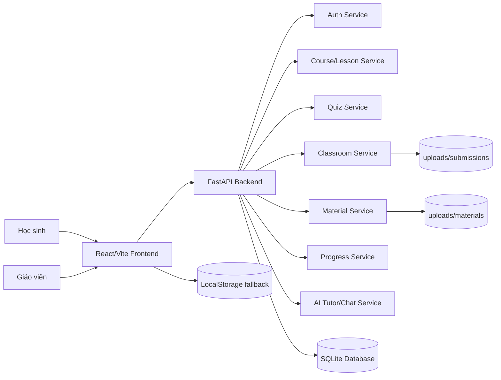
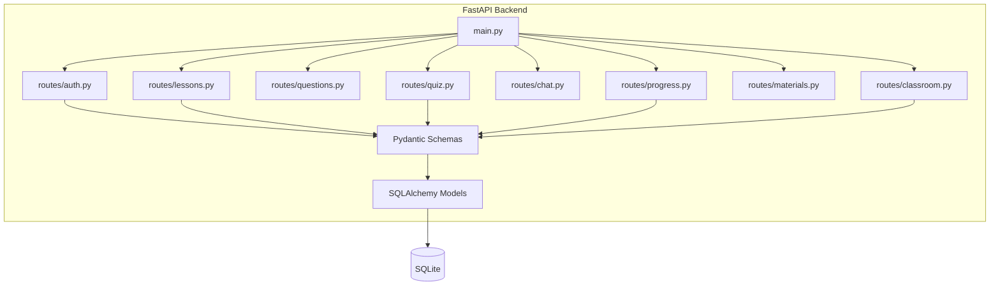
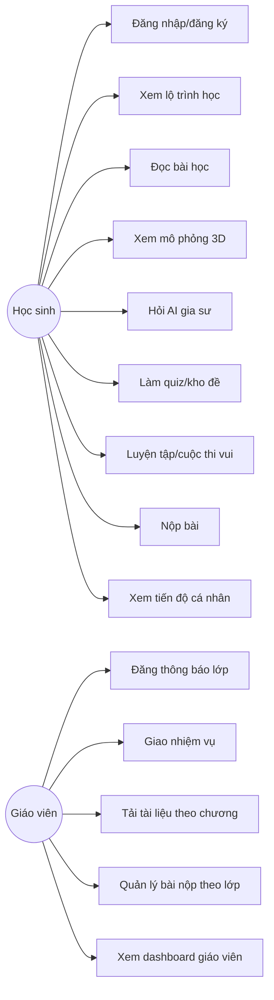
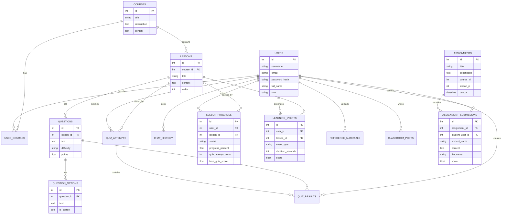
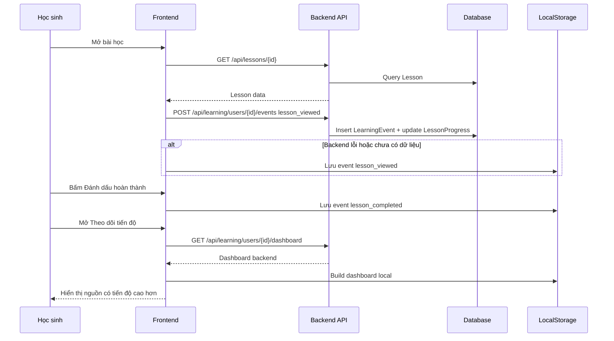
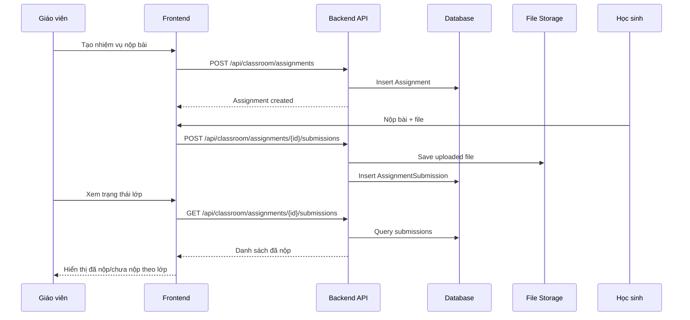
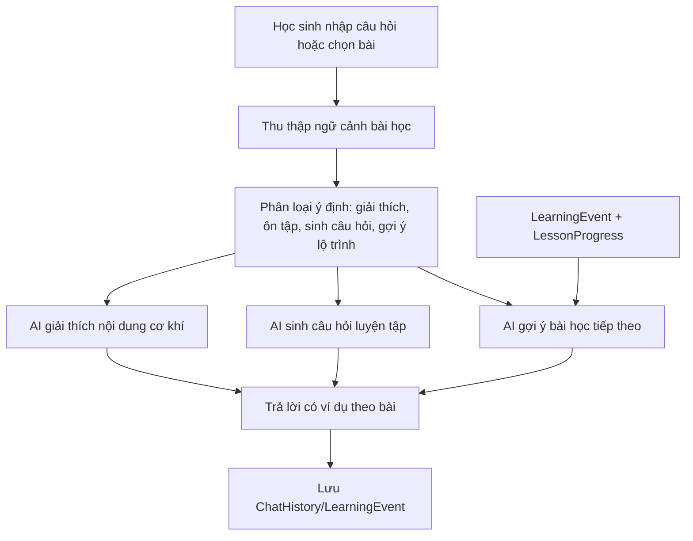

# EngineLab - Tài liệu kiến trúc hệ thống

## 1. Tổng quan hệ thống

EngineLab là nền tảng học tập Công nghệ THPT, tập trung vào cơ khí, động cơ đốt trong và ô tô. Hệ thống hỗ trợ học sinh học theo chương, xem mô phỏng 3D, làm quiz, luyện tập, nộp bài; giáo viên đăng thông báo, giao nhiệm vụ, quản lý bài nộp và theo dõi tiến độ.

## 2. Kiến trúc tổng thể

## 3. Backend Architecture

## 4. Use Case

## 5. ERD

## 6. Sequence Diagram - học bài và cập nhật tiến độ

## 7. Sequence Diagram - giáo viên giao bài và quản lý nộp bài

## 8. AI Flow

## 9. Các luồng AI có ích trong dự án

- AI giải thích động cơ: học sinh hỏi về piston, xupap, trục khuỷu, chu trình 4 kì; hệ thống trả lời theo bài học.
- AI sinh câu hỏi: tạo câu hỏi ôn tập từ nội dung bài/chương, có đáp án và giải thích.
- AI gợi ý lộ trình: dựa vào bài chưa học, quiz chưa làm, bài cần ôn.
- AI phân tích tiến độ: dùng LessonProgress, LearningEvent, điểm quiz để chỉ ra bài yếu và hành động tiếp theo.

## 10. Dashboard giáo viên

Dashboard giáo viên cần hiển thị:

- Tổng số học sinh/tài khoản học sinh.
- Số nhiệm vụ đã giao.
- Tổng số bài nộp.
- Tỉ lệ nộp bài theo từng nhiệm vụ/lớp.
- Hoạt động học tập: quiz, mô phỏng, hỏi AI, hoàn thành bài.
- Danh sách học sinh cần nhắc nộp bài hoặc cần hỗ trợ học tập.
